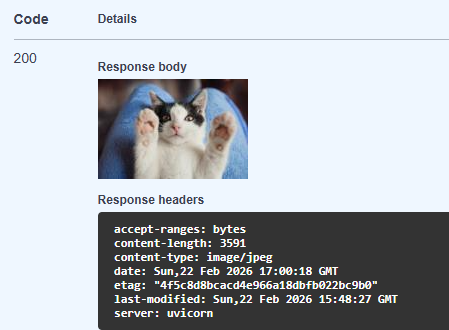
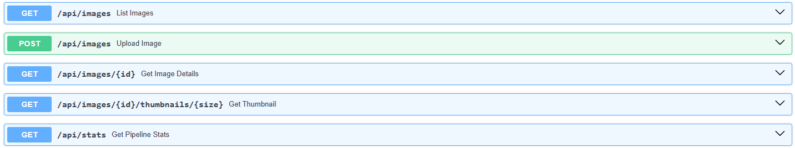

# HTX Take-Home Assessment

## Overview

The Image Processing Pipeline does the following:
- Supports uploading and processing of JPG/PNG images
- Validation checks are in place to prevent other file uploads besides **JPG** or **PNG** images
- Extracts basic image metadata (width, height, file format, file size, processing time)
- EXIF data of images
- Generates 2 thumbnails (small and medium)
- Generates an AI caption using an open-source BLIP model
- Stores and updates processing results in a SQLite database

Process done is **non-blocking** and it will return a unique image_id to the user immediately

---

## Libraries used

- FastAPI
- Uvicorn
- Transformers
- SQLite3
- Pillow
- PyTorch
- Pytest

---

## Setup Instructions

### 1. Clone the repository

```
git clone https://github.com/gtgavint/HTX_THA_DF.git
```
```
cd HTX_THA_DF
```
> If unable to git clone, download the file as ZIP

### 2. Create a virtual environment

```
python -m venv env
```
or 
```
python3 -m venv env
```

### 3. Activate the virtual environment
For Windows

```
env\Scripts\activate
```
For Linux

```
source env/bin/activate
```

### 4. Install required dependencies

```
pip install --upgrade pip
```
```
pip install -r requirements.txt
```

### 5. Run FastAPI server

```
uvicorn app.main:app
```
> Use uvicorn app.main:app --reload for automatic server restart if you made any changes to the program

The image pipeline can be tested on a web browser at:

```
http://127.0.0.1:8000/docs
```

---

## Command Line Usage Example

### Upload Image

```
curl -F "file=@your_file.jpg" http://127.0.0.1:8000/api/images
```

This is the response that you will get back when uploading a image:

```
{
  "image_id": "img123",
  "status": "processing"
}
```

If you uploaded a file that is not in JPG/PNG this is the response that you will get back:

```
{
  "detail": "Please upload only JPG or PNG files"
}
```

---

### Get Speciifc Image Processing Result

```
curl http://127.0.0.1:8000/api/images/<image_id>
```

This will return with the specific image data that was successfully processed:

```
{
  "status": "success",
  "data": {
    "image_id": "img123",
    "original_name": "neko.jpg",
    "processed_at": "2026-02-22T15:48:27.996831+00:00Z",
    "metadata": {
      "width": 3960,
      "height": 2640,
      "format": "png",
      "size_bytes": 4104953,
      "exif": {
        "ResolutionUnit": 2,
        "ExifOffset": 258,
        "ImageDescription": "White cat lies on woman's knees",
        "Make": "Canon",
        "Model": "Canon EOS 5D Mark III",
        "Software": "Adobe Photoshop Lightroom 6.0 (Windows)",
        "Orientation": 1,
        "DateTime": "2017:06:28 09:24:42",
        "DateTimeOriginal": "2017:06:24 13:21:31",
        "DateTimeDigitized": "2017:06:24 13:21:31",
        "MeteringMode": 5,
        "ColorSpace": 1,
        "Flash": 16,
        "ExposureMode": 0,
        "WhiteBalance": 1,
        "SceneCaptureType": 0,
        "FocalPlaneResolutionUnit": 3,
        "SubsecTimeOriginal": "47",
        "SubsecTimeDigitized": "47",
        "ExposureProgram": 3,
        "CustomRendered": 0,
        "ISOSpeedRatings": 640,
        "SensitivityType": 2,
        "BodySerialNumber": "218020000278",
        "RecommendedExposureIndex": 640,
        "LensModel": "EF35mm f/1.4L USM",
        "LensSerialNumber": "0000000000"
      },
      "caption": "there is a black and white cat sitting on a blue blanket"
    },
    "thumbnails": {
      "small": "http://localhost:8000/api/images/img123/thumbnails/small",
      "medium": "http://localhost:8000/api/images/img123/thumbnails/medium"
    }
  },
  "error": null
}
```

If there is an error, it will show this:

```
{
  "status": "failed",
  "data": {
    "image_id": "img000",
    "original_name": "testimg.jpg",
    "processed_at": "2026-02-22T18:51:40.525887+00:00Z",
    "metadata": {},
    "thumbnails": {}
  },
  "error": "unable to process file"
}
```

---

### List All Images

```
curl http://127.0.0.1:8000/api/images
```

This will returns a list of images that has been processes, the status will be either "success" or "failed".

---

### Get Thumbnail

If using the command line:
```
curl http://127.0.0.1:8000/api/images/<image_id>/thumbnails/small -o small_thumbnail.jpg
```
This will download the thumbnail to your computer

> If using the web browser, the thumbnail will show up in the response body


---

### Get Processing Statistics

```
curl http://127.0.0.1:8000/api/stats
```

This will return with the stats of the files uploaded and processesed.

```
{
  "total": 5,
  "failed": 1,
  "success_rate": "80.00%",
  "average_processing_time_seconds": 1.11
}
```

---

## Explanation on how the Image Processing Pipeline works


### Upload Image section
1. Upload an image (Either JPG or PNG) to the pipeline
2. If the file that is uploaded is not in JPG or PNG, an error message will be shown "Please upload only JPG or PNG files"
3. Once successfully uploaded, it will immediately be given an unique image_id and then saved locally under the "uploads" folder. Users can upload multiple photos
4. At the same time, it wil extract these information from the image: file creation timestamp, file size, metadata, EXIF
5. Thumbnails and thumbnail links will be generated and the caption is generated using BLIP, an open-source AI model from Salesforce
6. Information will then be stored in the SQLite3 database for retrieval later on

### Get Specific Image details
1. To get a specifc image details, enter the unique image_id on the web browser or use the curl command from "Get Speciifc Image Processing Result"
2. This will return with all the available information specific to that image
3. If the image cannot be processed, its status will be marked as "failed" and it will not show any specific information

### Get List of Images
1. If there are images previously uploaded, it will fetch all the images available information from the database
2. If there are no images uploaded and you try to fetch the data, it will return an empty list

### Get Specific Image Thumbnail Sizes
1. This allows you to view the thumbnail in different sizes
2. If you specify other than small or medium, it will return an error and inform the user to use either "small" or "medium"
3. Small is (150 x 150), Medium is (300 x 300)

### Get Pipeline Stats
1. This will return the user the total amount images uploaded to the pipeline, how many times it failed, success rate and the average processing time in seconds

---

## Logging

Logging is done using the logging library from Python

```
2026-02-22 00:31:23,240 [INFO] ImagePipeline: Starting processing for image_id: img356
2026-02-22 00:31:24,311 [INFO] ImagePipeline: Successfully processed img356 in 1.07s
2026-02-22 02:51:40,470 [INFO] ImagePipeline: Starting processing for image_id: img285
2026-02-22 02:51:40,524 [ERROR] ImagePipeline: Failed to process img285. Error: unable to process file
```

---

## Pipeline Testing

Testing was done using Pytest, run this python file to test:

```
pytest tester.py
```

Tests cover:

- Successful image upload
- Handling of invalid file upload
- Handling of invalid image_id
- /api/stats format

---

